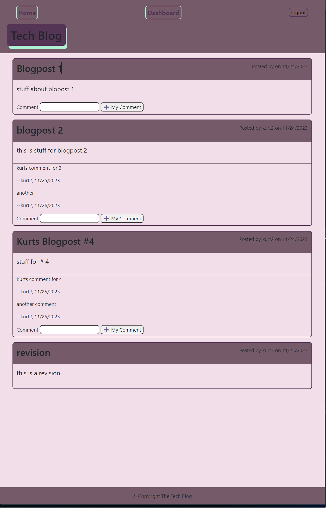
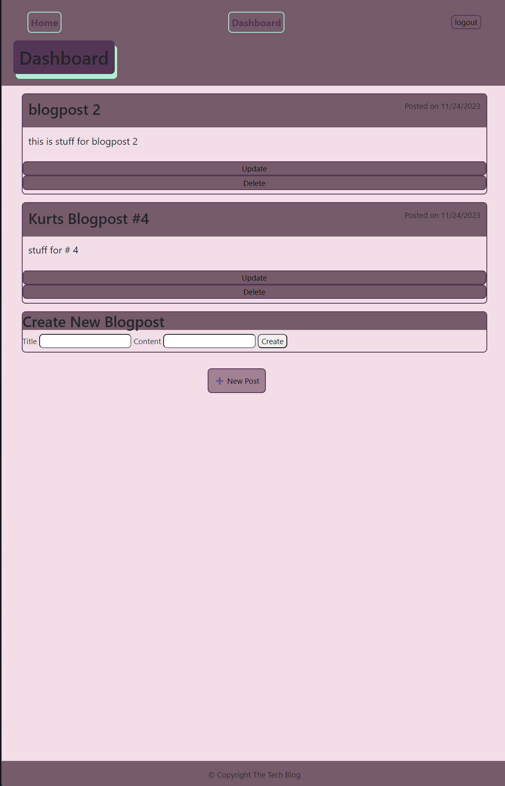

# Tech Blog - CMS-style Blog Site

## Homepage

### NavBar:
- Home, Dashboard, Signup, Login.
- If User is logged in a Logout button will replace Signup and Login buttons.
  Dashboard:
  - If User is logged in and clicks Dashboard they will be brought to their personal dashboard.
  - Else, message will display: to sign in to access Dashboard

### Blogposts:
- User see a list of Blogposts from various users and time when posted.
- Clicks on a blogpost they can see all the comments for that Blogpost along with athor of the comment.
- Input field to leave a comment and User can add their own comments.

### Signup:
- If User clicks Signup, an inputfield is displayed requiring a unique username and password at least 8 character long.

### Login:
- If User clicks Login, an inputfield is displayed with username and password.

## Dashboard

### Blogposts:
- User see a list of the blogpost they authored and when they did so.
- Can click on a blogpost and see all the comments for that specific blogpost.
- Can update or delete blogpost.

### New Blogpost Button:
- If clicked: Create New Blogpost appears with input fields.
- Add title and content and clicks Create, the blogpost is added the the list of blogposts

## Homepage Screenshot

## Dashboard Screenshot

## Deployed Page

- https://kurts-tech-blog-4b5c0e5dc80d.herokuapp.com/